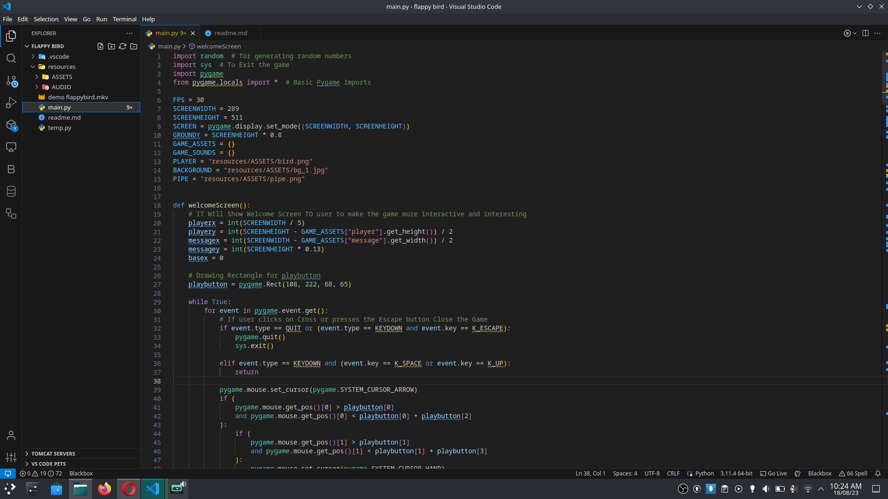
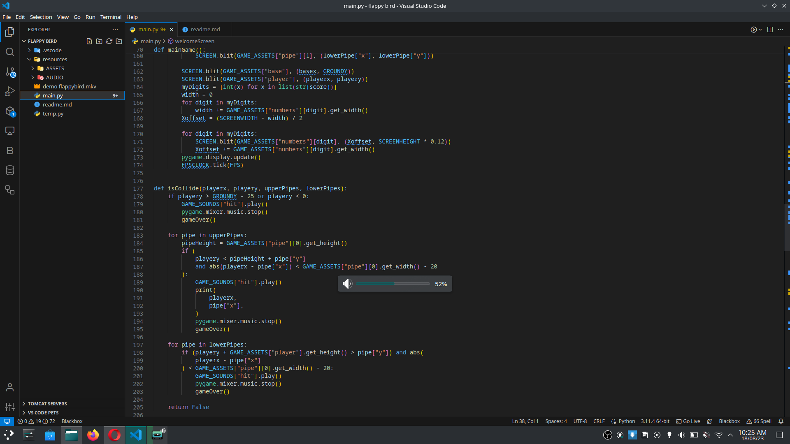

# Flappy Bird Game

Welcome to the Flappy Bird game! This is a simple implementation of the classic Flappy Bird game in Python.


## Table of Contents

- [About the Game](#about-the-game)
- [Screenshots](#screenshots)
- [Installation](#installation)
- [Usage](#usage)
- [Contributing](#contributing)

## About the Game

Flappy Bird is a popular side-scrolling game where the player controls a bird and tries to navigate it through a series of pipes without hitting them. The game gets progressively harder as the player advances, and the goal is to achieve the highest score possible.

## Screenshots




## Installation

To play the Flappy Bird game, you need to have Python and some required libraries installed. Follow these steps to set up the game:

1. Clone the repository to your local machine:
   ```
   git clone https://github.com/yourusername/flappy-bird.git
   cd flappy-bird
   ```

2. Create a virtual environment (optional but recommended):
   ```
   python -m venv venv
   source venv/bin/activate  # On Windows, use: venv\Scripts\activate
   ```

3. Install the required libraries from the `requirements.txt` file:
   ```
   pip install -r requirements.txt
   ```

4. Run the game:
   ```
   python flappy_bird.py
   ```

## Usage

- Press the spacebar to make the bird flap and avoid hitting the pipes.
- Your goal is to achieve the highest score possible by navigating the bird through the gaps in the pipes.

## Contributing

Contributions are welcome! If you find any issues or have ideas for improvements, feel free to submit a pull request.
